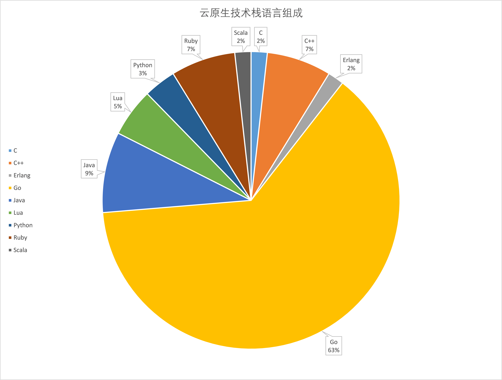

## 1. 前言

毫无疑问未来几年是云原生的时代，云原生时代的技术绝大部分是用Go构建的，这里做了一个统计，可供大家参考：



毫无疑问Go在云原生时代占有举足轻重的地域，可以好不夸张的说，Go是云时代的语言。

Go语言是一门简单、易学的编程语言，对于有一定编程经验的工程师来说，学习Go语言并完成代码的运行、功能的构建是一件很轻松的事，但如果想真正利用好Go这个语言工具，写出优雅的代码，就要花时间去研究这门语言的设计哲学，融入Go的生态，并遵守Go生态中一些约定俗称的标准、规范以及最佳实践。笔者做了一些调研，这里分享出来，水平有限，写的不对的地方，请轻拍。本规范主要会涉及到如下几个方面：

+ 代码规范
+ 辅助工具
+ 目录结构

## 2. 代码规范

代码规范是最基本的规范，Go语言比较常见并且使用广泛的代码规范就是官方提供的[Go Code Review Comments](https://github.com/golang/go/wiki/CodeReviewComments)，该代码规范是对编程风格[Effective Go](https://golang.org/doc/effective_go.html)的一个补充，如果你是一名Go开发人员，那么至少应该完整地阅读一遍Go Code Review Comments和Effective Go。这些规范不仅是在我们编写代码时应该遵守的规范，也是在代码时需要注意的规范。

遵循Go的代码规范是一件非常重要的事情，但是Go的规范很多，很多时候要遵循每一个规范是一件困难的事情，即使对一些资深的Go开发人员也是这样。所以很多时候，我们要借助一些工具，来检查代码是否遵循了开发规范。幸运的是，Go生态中有很多这类工具，通过这类工具一方面可以强制性的检查代码是否遵循了我们期望的规范，另一方面通过这类工具也可以将代码规范检查自动化，节省人力，提高开发效率，减少人肉审查带来的误差。

## 3. 辅助工具

辅助工具大概可以分为2类：

+ 格式化工具
+ 静态代码检查工具

### 3.1 格式化工具

[goimports](https://godoc.org/golang.org/x/tools/cmd/goimports)是Go语言官方提供的工具，它能够为我们自动格式化Go语言代码并对所有引入的包进行管理，包括自动增删依赖的包引用、将依赖包按字母序排序并分类。很多人都用过gofmt来对代码进行格式化，goimports等于gofmt加上依赖包管理（goimports=gofmt + import）。

很多IDE都支持在保存代码时执行goimports，使用goimports可能会偶尔引入一些错误的包，但是它带来的好处也是明显的，这里建议大家每次写完代码后都goimports一下，如果不想用goimports，那么至少要用gofmt格式化下代码。

### 3.2 静态代码检查工具

[golangci-lint](https://github.com/golangci/golangci-lint)是一个linter聚合器，它的速度很快，平均速度是gometalinter的5倍。它易于集成和使用，具有良好的输出并且具有最小数量的误报，支持YAML配置。目前是Go项目静态代码检查的最佳工具。

golangci-lint虽然可以灵活的通过YAML文件配置检查和不检查哪些规则，但这里建议每个项目，起初都开启最严的检查配置，不要随意忽略某个检查项。

> golangci-lint官方文档，请参考：[golangci-lint官方文档](https://golangci-lint.run/)

## 4. 目录结构

目录结构基本上就是一个项目的门面，很多时候我们从目录结构中就能够看出开发者对这门语言是否有足够的经验，所以这里首先介绍下如何在Go语言的项目或者服务中组织代码。

一个好的代码结构，不仅可以形成规范，减少其他研发同学熟悉的成本，还可以合理的组织代码，增加可读性和清晰度，从另一个维度减少Bug。

Go官方并没有给出一个推荐的代码组织方式，所以目前很多Go项目代码组织比较随意，一个小型的项目，代码结构比较随意可能不会有大问题，但是随着项目的迭代，功能模块越来越多，源码越来越大的时候，一个比较随意的代码结构会带来很多问题：
+ 可读性差，新人熟悉成本高
+ 组织混乱，排障困难
+ 测试、维护和扩展困难
+ 功能模块随意存放，逻辑不清晰，并可能因此引入bug。

为了解决这些问题，最好一开始就有一个比较规范的代码组织方式，并形成规范。目录结构，大概可以分为2种：

+ 结构化目录结构
+ 平铺式目录结构

### 4.1 结构化目录结构

当前Go社区有一个推荐的Go结构化目录结构：[project-layout](https://github.com/golang-standards/project-layout)，不是规范，但是其组织方式比较合理，也被很多Go开发人员所接受，可以认为是一个事实的规范，笔者结合project-layout，并参考了其它项目，比如：[kubernetes](https://github.com/kubernetes/kubernetes)，总结出了如下一套Go的代码结构组织方式，包含organization目录和子项目目录。

Go在 1.11 以后，弱化了GOPATH规则，为了便于维护代码，建议保留 GOPATH 规则。项目存放目录建议这样放置：`${GOPATH}/src/${GitHost}/{$GitUser}|${GitGroup}/${ProjectRoot}`

+ GitHost：git 仓库域名
+ GitUser：git 用户名称 同 GitGroup 二选一
+ GitGroup：git 工作组名称 GitUser 二选一
+ ProjectRoot：项目根目录


#### 4.1.1 organization（也就是GitGroup）目录

对于一个大型项目来说，一般是多人协作，所以一般我们会为该项目建议一个独立的git organization，并有一个organization目录，来存放相关的代码。organization一般创建在：`${GOPATH}/src/${GitHost}/`目录下。在该organization目录下，我们可以存放跟当前项目相关的子项目，或者所有子项目都需要的通用的包，比如：log, errors。这里假设我们用的代码托管平台是github，项目名称是：marmotedu。所以第一步，我们需要创建目录：`$GOPATH/src/github.com/marmotedu`，目录内容为：

```bash
├── api
├── apimachinery
├── errors
├── iam
├── log
├── marmotedu-sdk-go
└── tms
```

这里我们介绍下marmotedu目录下可以存放什么内容以及他们的作用：

+ 子项目
一个项目可能包含很多子项目，这些子项目是平级的关系，这时可以统一放置在marmotedu目录下，比如：
    + iam: 核心子项目（Identity and Access Management，身份识别与访问管理）。
    + marmotedu-sdk-go：sdk源码目录，对于一个项目，为了能够更好的对外提供服务，提高用户体验和开发效率，需要提供一个SDK，供第三方调用。
    + tms：（Transportation Management System，运输管理系）marmotedu项目的另外一个子项目。
+ 基本的、共用的包
    + errors：错误包
    + log：log包
+ 为了解决钻石依赖，而独立出来的包
    + api：RESTful API/protobuf结构定义文件
    + apimachinery：所有子项目共用的包，跟项目有关联，但不跟子项目有关联

#### 4.1.2 子项目目录

在讲目录组织之前，我们先来看下，一个通用的Go项目应该包含哪些功能，这些功能需要在Go目录结构中有对应的目录支持：
+ 项目介绍：README.md
+ 客户端：xxxctl
+ API文档
+ 构建配置文件，CICD配置文件
+ CHANGELOG
+ 项目配置文件
+ kubernetes部署定义文件
+ systemd/init部署配置文件（物理机/虚拟机部署方式需要）
+ 项目文档
+ commit message格式检查或者其他githook
+ 请求参数校验
+ 命令行flag
+ 共享包：
    + 外部项目可导入
    + 只有子项目可导入
+ storage接口
+ 项目管理：Makefile，完成代码检查、构建、打包、测试、部署等
+ 版权声明
+ _output目录（编译、构建产物）
+ 引用第三方包
+ 脚本文件（可能会借助脚本，实现一些源码管理、构建、生成等功能）
+ 测试文件

下面是一种Go目录结构实现方式：

```bash
├── api
│   ├── openapi
│   └── swagger
├── build
│   ├── ci
│   ├── docker
│   │   ├── iam-apiserver
│   │   ├── iam-authz-server
│   ├── package
├── CHANGELOG
├── cmd
│   ├── gendocs
│   ├── genman
│   ├── genswaggertypedocs
│   ├── iam-apiserver
│   │   └── apiserver.go
│   ├── iam-authz-server
│   │   └── authzserver.go
│   ├── iamctl
│   │   └── iamctl.go
├── configs
├── CONTRIBUTING.md
├── deployments
├── docs
│   ├── devel
│   ├── guide
│   │   ├── en-US
│   │   └── zh-CN
│   │       ├── best-practices
│   │       ├── FAQ
│   │       ├── features
│   │       ├── installation
│   │       ├── quickstart
│   │       └── README.md
│   ├── images
│   ├── man
│   │   └── man1
│   ├── README.md
├── examples
├── githooks
├── go.mod
├── go.sum
├── init
├── internal
│   ├── apiserver
│   │   ├── api
│   │   │   └── v1
│   │   │       └── user
│   │   ├── options
│   │   ├── server.go
│   │   ├── service
│   │   ├── store
│   │   │   ├── datastore
│   │   │   ├── fake
│   │   └── testing
│   ├── authzserver
│   │   ├── api
│   │   │   └── v1
│   │   ├── options
│   │   ├── store
│   │   └── testing
│   ├── iamctl
│   │   ├── cmd
│   │   │   ├── completion
│   │   │   ├── user
│   │   └── util
│   └── pkg
│       ├── code
│       ├── options
│       ├── server
│       ├── util
│       └── validation
├── LICENSE
├── Makefile
├── _output
│   ├── platforms
│   │   └── linux
│   │       └── amd64
├── pkg
│   ├── util
│   │   └── genutil
├── README.md
├── scripts
│   ├── golangci-lint
│   ├── lib
│   ├── make-rules
├── test
│   ├── testdata
├── third_party
│   └── forked
└── tools
```

接下来，我们详细介绍一下，每个目录和文件的作用，帮助我们快速理解如何使用如上所示的目录结构，大家也可以参考：[golang-standards/project-layout](https://github.com/golang-standards/project-layout)进行理解。这些目录和文件大概可以分成如下几类：

+ 通用应用目录：存放一些前后端项目类型都适用的目录
+ Go 目录：存放跟Go语言相关的目录
+ 服务应用目录：存放后端API服务相关的目录
+ Web 应用目录：存放前端相关的目录
+ 其他目录：其它的目录，工具、文档、示例等。

#### 4.1.3 通用应用目录

**/README.md**

项目的README文件，一般包含了项目的介绍、功能、快速安装和使用指引、详细的文档链接以及开发指引等。有时候README.md文档会比较长，为了能够快速定位到所需内容，需要添加markdown toc索引，可以借助工具：[tocenize](https://github.com/nochso/tocenize)来完成索引的添加。

**/LICENSE**

版权文件，可以是私有的也可以是开源的。常用的开源协议有：Apache 2.0、MIT、BSD、GPL、Mozilla、LGPL。公有云产品有时候为了打造品牌影响力，会选择对外发布一个本产品的开源版本，所以在项目规划初期最好也能规划下，未来产品的走向，选择合适的LICENSE。

我们可能会需要将LICENSE头添加到源码文件或者其他文件中，声明版权，推荐工具：[addlicense](https://github.com/google/addlicense)

当我们代码中引用了其它的开源代码，这时，我们需要在我们的LICENSE中说明对其它源码的引用，我们可能需要知道我们用了哪些源码，这些源码的使用了什么开源协议，这时也可以借助工具来进行检查，推荐工具：[glice](https://github.com/ribice/glice)

**/CONTRIBUTING.md**

如果是一个开源就绪的项目，最好还要有一个CONTRIBUTING.md文件，用来说明如何给该项目做共享，如何开源协同。

**/Makefile**

虽然Makefile是一个很老的项目管理工具，但是目前的项目管理工具比较推荐的方式仍然是Makefile，所以一个Go项目在其根目录下应该有一个Makefile工具，用来对项目进行管理，一般管理的内容包括：

+ 静态代码检查(lint)：推荐用golangci-lint。
+ 单元测试(test)：运行go test ./...。
+ 编译(build)：支持不同的平台，不同的CPU架构。
+ 镜像打包和Push(image/image.push)：现在的系统比较推荐用Docker/Kubernetes进行部署，所以一般也要有镜像构建功能。
+ 清理（clean）:清理临时文件或者编译后的产物。
+ 代码生成（gen）：比如要编译生成protobuf pb.go文件。
+ 部署（deploy，可选）：一键部署功能，方便测试。
+ 发布（release）：发布功能，比如：发布到Docker Hub，发布到github等。
+ 帮助（help）:告诉Makefile有哪些功能，如何执行这些功能。

其中建议：直接执行make时，执行如下各项：lint -> test -> build。

**/scripts/make-rules**

Makefile有很多功能，为了保持一个简洁的Makefile，建议将各个子功能的实现放在 `/scripts/make-rules`文件夹下，例如：`/scripts/make-rules/image.mk`，然后再Makefile中include，以保证一个小而简单的Makefile文件。

**/scripts**

该目录就像目录名一样，主要用来存放各类脚本文件，实现各类自动化功能，比如：执行各种构建、安装、分析等操作。这里也建议几个子目录：

+ `/scripts/make-rules`：存放makefile文件，实现/Makefile文件中的各个子功能。
+ `/scripts/lib`：shell库，一个大型项目，需要对项目做各种自动化操作，比如：发布、更新文档、生成代码等，所以不可避免的要写很多shell脚本，这些shell脚本会有一些通用功能，可以抽象成库，存放在`/scripts/lib`目录下，比如：logging.sh，util.sh等

**/CHANGELOG**

当项目有更新时，为了能够一目了然的了解当先版本的更新内容以及历史的更新内容，需要将更新记录存放到CHANGELOG目录。可以结合[Angular规范](https://github.com/angular/angular/blob/22b96b9/CONTRIBUTING.md#-commit-message-guidelines)和[git-chglog](https://github.com/git-chglog/git-chglog)自动生产CHANGELOG。

**/build**

这里存放包和持续集成相关的文件。该目录建议有3个子目录：

+ `/build/package`：存放云上（AMI）、容器（Docker）、系统（deb, rpm, pkg）的包配置和脚本。
+ `/build/ci`：存放CI（travis, circle, drone）的配置文件和脚。
+ `/build/docker`：存放子项目各个组件的Dockerfile文件。

**/configs**

配置文件模板或默认配置。在这里放你的 confd 或 consul-template 模板文件。

**/deployments**

Iaas，PaaS，系统和容器编排部署配置和模板（docker-compose, kubernetes/helm, mesos, terraform, bosh）。在一些项目中，尤其是用kubernetes部署的项目中，这个目录命名可能为deploy。

**/init**

存放始化系统（systemd, upstart, sysv）和进程管理配置文件（runit, supervisord）。比如：sysemd的unit文件。

**/test**

其他外部测试应用和测试数据。你可以随意构建 /test 目录。对于更大的项目，有一个数据子目录是有意义的。例如，如果需要Go忽略该目录中的内容，可以使用 /test/data 或 /test/testdata 目录。请注意Go也会忽略以"." 或 "_" 开头的目录或文件。因此你在命名测试数据目录方面具有更大的灵活性。

#### 4.1.4 Go目录

**/go.mod，/go.sum**

这2个文件是必备的，现在Go项目的依赖管理统一用的是Go Modules，用Go Modules这2个文件肯定是必须要有的，而且建议将go.sum也加入到git仓库中进行管理。

+ go.mod：定义了它所在的目录为一个模块，并且记录了该模块的依赖包。
+ go.sum：记录每个依赖库的版本和哈希值。

**/cmd**

一个项目有很多组件，可以把组件的main文件统一放在/cmd目录下，例如：

```
[lk@dev iam]$ ls cmd/
gendocs  geniamdocs  genman  genswaggertypedocs  genyaml  iam-apiserver  iam-authz-server  iamctl  iam-pump

[goer@dev iam]$ ls cmd/iam-apiserver/
apiserver.go
```

每个组件的目录名称应该跟你期望的可执行文件的名称是一致的。

不要在应用目录中放很多代码，如果代码可以被公开访问可以存放到 `/pkg`目录下，如果代码可以被内部共享可以存放到`/internal/pkg`目录下。如果代码不是一个可被共享的代码，那应该存放在跟它关联的应用目录下：`/internal/apiserver`

通常要保证这个main函数代码尽可能简单和少，更多的功能，可以通过导入/internal或者/pkg中的包来实现。

**/internal**

私有应用和库代码。这是你不希望其他人在其他应用和库中导入的代码。当我们在其他项目引入包含 internal 的依赖时，Go 语言会在编译时报错：

```go
An import of a path containing the element “internal” is disallowed
if the importing code is outside the tree rooted at the parent of the
"internal" directory.
```

可以通过Go语言本身机制来约束其他项目import项目内部的包。

该目录建议包含如下目录：

+ `/internal/apiserver`：该目录中存放真是的应用代码。这些应用的共享代码存放在 `/internal/pkg`目录下。
+ `/internal/pkg`：应用的共享代码，一般建议一开始将所有的共享代码存放在`/internal/pkg`目录下，当该共享代码，做好了对外开发的准备后，在转存到`/pkg`目录下。


这里我们详细再介绍下 `/internal`目录，因为我们把所有的实现都存放在这个目录中，所以内容量会比较大，这里我们看下 `/internal`目录又需要怎么组织：

```bash
├── apiserver
│   ├── api
│   │   └── v1
│   │       └── user
│   ├── options
│   ├── service
│   │   └── user.go
│   ├── store
│   │   ├── datastore
│   │   │   └── user.go
│   │   ├── fake
│   └── testing
├── authzserver
│   ├── api
│   │   └── v1
│   ├── options
│   ├── store
│   └── testing
├── iamctl
│   ├── cmd
│   │   ├── cmd.go
│   │   ├── info
└── pkg
    ├── code
    ├── middleware
    ├── options
    └── validation
```

/internal目录下大概分为3类子目录：

+ pkg：内部共享包存放目录
+ `/internal/authzserver`、`/internal/apiserver`：应用目录，里面包含应用程序的实现代码。
+ `/internal/iamctl`：对于一些大型项目，可能还会需要一个客户端工具

在每个应用程序内部，也会有一些目录结构，这些目录结构主要根据功能来划分：

+ `/internal/apiserver/api/v1`：HTTP Method，主要用来做HTTP请求的解包、参数校验、业务逻辑处理、返回。注意这里的业务逻辑处理应该是轻量级的，如果业务逻辑比较复杂，代码量比较多，建议存放到：`/internal/apiserver/service`目录下。该源码文件主要用来串流程。
+ `/internal/apiserver/options`：应用的command flag。
+ `/internal/apiserver/service`：存放应用复杂业务处理代码。
+ `/internal/apiserver/store/datastore`：一个应用很可能要持久化的存储一些数据，这里主要存放跟storage交互的代码，比如：Create、Update、Delete、Get、List等。这里有个比较好的实践方式：把具体的存储和store通过golang接口进行解耦，这样，以后可以很方便的切换到其它存储类型，也可以进行fake测试。具体实现存放在`/internal/apiserver/store/datastore`目录下，相关接口存放在`/internal/apiserver/store`目录下。

在`/internal/pkg`目录下，存放的是项目内部的一些共享包，通常也可以包含如下目录：

+ `/internal/pkg/code`：项目业务Code码
+ `/internal/pkg/validation`：一些通用的验证函数
+ `/internal/pkg/middleware`：HTTP处理链

**/pkg**

/pkg 目录是 Go 语言项目中非常常见的目录，我们几乎能够在所有知名的开源项目（非框架）中找到它的身影，例如：

+ [kubernetes](https://links.jianshu.com/go?to=https%3A%2F%2Fgithub.com%2Fkubernetes%2Fkubernetes)
+ [prometheus](https://links.jianshu.com/go?to=https%3A%2F%2Fgithub.com%2Fprometheus%2Fprometheus)
+ [moby](https://github.com/moby/moby)
+ [knative](https://github.com/knative/serving)

该目录中存放可以被外部应用使用的代码库，其他的项目可以直接通过 import 引入这里的代码。所以我们在将代码库，放入该目录时一定要慎重。

**/vendor**

项目依赖，可通过`go mod vendor`创建。需要注意的是，如果是一个Go库，不要提交vendor依赖包。

#### 4.1.5 服务应用目录

**/api**

OpenAPI/Swagger 说明，JSON 概要文件，协议定义文件。

#### 4.1.6 Web 应用目录

**/web**

Web 应用特定组件：web 静态资源，服务端模板和单页应用（SPAs）。

#### 4.1.7 其它目录

**/docs**

设计和用户文档（除了 godoc 生成的文档）。

推荐该目录下存放如下几个子目录：

+ `/docs/devel`：存放开发文档，hack文档等。
+ `/docs/guide/{en-US,zh-CN}`: 存放用户手册，安装、quickstart、产品文档等，分为中文文档和英文文档。

**/tools**

这个项目的支持工具。请注意这些工具能导入来自/pkg和/internal目录的代码。

**/examples**

存放应用程序或者公共包的示例代码。

**/third_party**

外部帮助工具，分支代码或其他第三方实用应用（e.g., Swagger UI）。比如我们fork了一个第三方go包，并做了一些小的改动，我们可以放在目录`/third_party/forked`下，一方面可以很清楚的知道该包是fork第三方的，另一方面又能够方便的和upstream同步。

**/githooks**

Git钩子。比如，我们可以将commit-msg存放在该目录。

**/assets**

项目使用的其他资源(图片、CSS、Javascript 等)

### 4.2 平铺目录结构

上面介绍了一种开发项目比较通用的目录结构，但如果我们的项目不是一个应用，而仅仅是一个代码框架/库，这时也可根据实际需要采用另外一种代码组织结构：平铺。

平铺方式也就是在项目的根目录下存放项目的代码，这种方式在很多框架/库中存在，使用这种方式的好处是引用路径明显减少，比如：`github.com/marmotedu/log/pkg/options`，可缩短为：`github.com/marmotedu/log/options`。

## 5. 小结

总体来说，每一个团队Go项目的组织方式都应该是固定的，有规范的，至于遵循什么规范，可能每个团队不一样。但总有一些比较好的组织方式，这些组织方式经过很多大型项目的验证，在清晰度、可扩展性、合理性上都有很好的验证，每个团队在进行规范调研和制定时，可以遵循这些规范，并根据实际的需求进行微调，当然这个不是强制要求的。


## 6. 参考
+ [Effective Go](https://golang.org/doc/effective_go.html)
+ [Go Code Review Comments](https://github.com/golang/go/wiki/CodeReviewComments)
